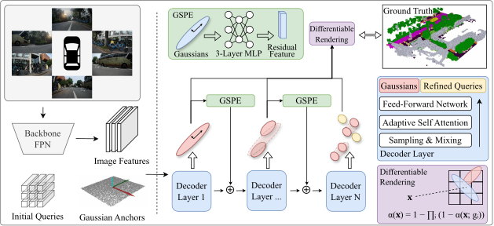

<div align="center">

# 🌲 GaussianSeed: Hierarchical Gaussian Seeding for High-Resolution 3D Occupancy Prediction

[Xinzhuo Li](https://github.com/athameral)<sup>\*</sup>, [Xinaghui Pan]()<sup>\*</sup>, [Jiayuan Du](https://github.com/MrPicklesGG), Wei Wei, Liuyi Wang, Chengju Liu<sup>†</sup>, Qijun Chen


[📄 Paper (arXiv)](https://arxiv.org/abs/2607.20071) | [🌐 Project Page](https://github.com/Athameral/GUSD) | [📊 TJScenes Dataset](https://dataset.tjscenes.org)

---



*The overall architecture of the GaussianSeed framework. At each decoder layer, queries are progressively refined leveraging multi-scale image features. These refined queries are subsequently decoded into 3D Gaussian primitives and rendered into the voxel space, where the dense occupancy ground truth is applied for direct supervision.*

</div>

---

## 🌟 News
* **[2026-07]** arXiv report is released!

---

## 📸 Visualizations

### Visualization on TJScenes

<p align="center" style="width: 100%; margin-top: 4px;">
  <span style="display: inline-block; width: 33%; text-align: center;"><b>Ground Truth</b></span>
  <span style="display: inline-block; width: 33%; text-align: center;"><b>Gaussians</b></span>
  <span style="display: inline-block; width: 33%; text-align: center;"><b>Predicted Occupancy</b></span>
<video src="https://github.com/Athameral/GUSD/releases/download/untagged-6d2b1d322741aa1eecfa/tjscenes_gt_gs_pred.mp4" width="100%" autoplay loop muted playsinline></video>
</p>

### Visualization on Occ3D-nuScenes

<p align="center">
  
  <span style="display: inline-block; width: 49%; text-align: center;"><b>Ground Truth</b></span>
  <span style="display: inline-block; width: 49%; text-align: center;"><b>Predicted Occupancy</b></span>
  
  <video src="https://github.com/Athameral/GUSD/releases/download/untagged-6d2b1d322741aa1eecfa/occ3d_nuscenes_gt_gs_occ_900.mp4" width="100%" autoplay loop muted playsinline></video>
  
 
  <span style="display: inline-block; width: 49%; text-align: center;"><b>Gaussians @ layer 1st</b></span>
  <span style="display: inline-block; width: 49%; text-align: center;"><b>Gaussians @ layer 5th</b></span>
</p>


> **Note:** Here is where you highlight your two visual results! Interactive or dynamic GIFs work best to show depth and resolution.

---

## 🔥 Highlights

* **High Resolution (0.1m):** Pushes the boundaries of fine-grained 3D perception for autonomous driving.
* **Real-time Efficiency:** Achieves less than **50 ms** latency with sparse Gaussian representations.
<!-- * **TJScenes Dataset:** A new high-precision benchmark for urban occupancy prediction. -->

---

## 🛠️ Getting Started

### 1. Installation
```bash
git clone [https://github.com/Athameral/GUSD.git](https://github.com/Athameral/GUSD.git)
cd GUSD
conda create -n gaussian_seed python=3.8 -y
conda activate gaussian_seed
pip install -r requirements.txt
```

### 2. Train
```bash
torchrun --nproc_per_node <your_gpu_number> train.py --config <your_config>
```
